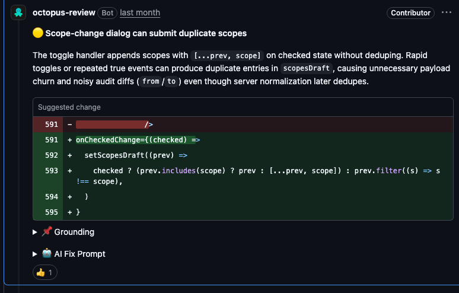
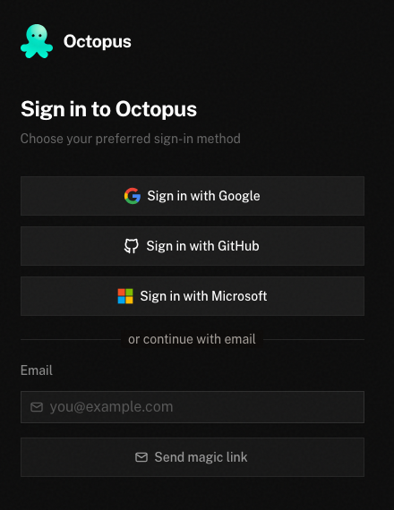

  

# Octopus

AI code review for your pull requests. Get a review summary, severity-ranked findings and suggested fixes in GitHub, GitLab or Bitbucket.

**[Try Octopus Cloud](https://octopus-review.ai/login)** · **[Self-host Octopus](https://octopus-review.ai/docs/self-hosting)** · [Documentation](https://octopus-review.ai/docs)

  
  
  

*An actual inline finding from [public PR #744](https://github.com/octopusreview/octopus/pull/744#discussion_r3775719896). The [author confirmed the fix](https://github.com/octopusreview/octopus/pull/744#discussion_r3775726260). Captured 11 September 2026.*

## Choose your offering

| | Octopus Cloud | Octopus Self-hosted |
| --- | --- | --- |
| Hosting | Managed by Octopus. | Run on your own infrastructure. |
| Setup | Sign in, connect your code host and select repositories. | Deploy with Docker Compose, then configure your code host and AI providers. |
| Costs | Usage-based pricing; bring your own provider keys if preferred. | You cover hosting and AI provider costs. Source available under the [Modified MIT License](LICENSE.md). |
| Start here | [Cloud quickstart](https://octopus-review.ai/docs/getting-started) · [Pricing](https://octopus-review.ai/docs/pricing) | [Self-hosting guide](https://octopus-review.ai/docs/self-hosting) |

## Getting started

### Octopus Cloud

For GitHub projects, give your coding AI the [homepage setup prompt](https://octopus-review.ai/#agent-setup). It uses the native CLI to set up the repository in your current project; you approve sign-in and GitHub access. See the [CLI guide](https://octopus-review.ai/docs/cli) for installation and agent setup.

To set up through the dashboard instead:

1. [Sign in](https://octopus-review.ai/login) with Google, GitHub, Microsoft or an email magic link.
2. Create your organization, connect GitHub, GitLab or Bitbucket, and choose the repositories to review.
3. Open a pull request or merge request. Read the review in your code host and address the findings there.

  

*The real Cloud sign-in screen, captured 11 September 2026. See the [getting-started guide](https://octopus-review.ai/docs/getting-started) for the remaining setup steps.*

### Octopus Self-hosted

Deploy Octopus on infrastructure you manage, with control over configuration and model providers. Follow the [self-hosting guide](https://octopus-review.ai/docs/self-hosting) for Docker Compose, environment setup and migrations, then configure your [GitHub App](https://octopus-review.ai/docs/github-app) or another [code-host integration](https://octopus-review.ai/docs/integrations).

## Features

- **Review where you work:** summaries, inline findings and suggested fixes in GitHub, GitLab and Bitbucket; [CLI reviews](https://octopus-review.ai/docs/cli) for terminal workflows.
- **Use your team's context:** indexed repository context, knowledge documents, and repo rules in `.octopus.md`, `AGENTS.md` or `CLAUDE.md`.
- **Choose your AI provider:** organization-level model settings and support for your own API keys.
- **Understand the result:** severity levels, category scores and explicit [review coverage](docs/review-coverage.md), including incomplete results.

## Contributing

See [CONTRIBUTING.md](CONTRIBUTING.md) for local development and validation. Propose improvements in [GitHub Discussions](https://github.com/octopusreview/octopus/discussions), report bugs in [Issues](https://github.com/octopusreview/octopus/issues), or help with the [roadmap](ROADMAP.md).

## Roadmap

Follow [planned work](ROADMAP.md) and [shipped changes](https://octopus-review.ai/docs/changelog).

## Security

See [SECURITY.md](SECURITY.md) to report a vulnerability privately.

## License

Source available under the [Modified MIT License](LICENSE.md), including its commercial attribution condition.
